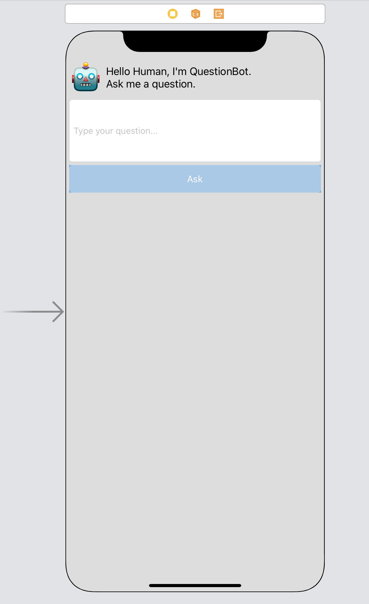

# QuestionBot-SwiftUI
This is a version of the QuestionBot project that appears in the Develop in Swift Explorations curriculum (https://apple.co/developinswiftexplorations), but re-done in SwiftUI.

The intention is to show you how you might translate a familiar UI to SwiftUI and what it means for your code. You will be able to compare and constrast this project against your own QuestionBot project from Develop in Swift Explorations.

For this project, you will need:
* A Mac (running Catalina, macOS 10.15, at least)
* Xcode (version 12 is better)

## The Setup
In QuestionBot, in Explorations, your focus is on building the brains for your app. The file `QuestionAnswerer.swift` defines a `MyQuestionAnswerer` struct that has one simple function:

```
    func responseTo(question: String) -> String {
        // TODO: Write a response
        return "?"
    }
```

You may have also changed your layout by editing the `Main.storyboard` file:



This is the user interface we're going to replicate in SwiftUI, and wWe're going to re-use the brains that you wrote in our SwiftUI version of the app.

## How to Use this Repo
I would highly recommend you start with the [`start` branch](https://github.com/mhanlon/QuestionBot-SwiftUI/tree/start). This is where we slowly build up our user interface in SwiftUI. And then we progress through the other branches described below. 

If you want to leap in and try your hand at any given step, try starting with the one before and see if you can't implement the next thing we tackle. For example, if you wanted to give styling the view a shot once it's been laid out, check out the `ui-layout` branch and see what you can come up with. Compare it to what we did in `ui-styling`. There's more than one way to do it, so if your solution doesn't match ours I wouldn't panic!

## Progress
### `start`
In the [`start` branch](https://github.com/mhanlon/QuestionBot-SwiftUI/tree/start), we begin with a default SwiftUI app with a `QuestionAnswerer.swift` file added. If you've written your logic as a part of the original QuestionBot assignment, feel free to copy and paste in your code.

### `ui-layout`
In the [`ui-layout` branch](https://github.com/mhanlon/QuestionBot-SwiftUI/tree/ui-layout), we begin replacing the default SwiftUI views with a layout similar to what we have in the storyboard version. We have very little styling (other than setting the font style for our QuestionBot emoji), but it looks roughly, *very* roughly, like our original QuestionBot.

### `ui-styling`
In the [`ui-styling` branch](https://github.com/mhanlon/QuestionBot-SwiftUI/tree/ui-styling), we start making the interface look a *lot* more like our original QuestionBot sample.

### `action`
In the [`action` branch](https://github.com/mhanlon/QuestionBot-SwiftUI/tree/action), we'll hook up the Ask button to hit our logic from the `QuestionAnswerer.swift`.

### `styledUIAndFeedback`
In the [`styledUIAndFeedback` branch](https://github.com/mhanlon/QuestionBot-SwiftUI/tree/styledUIAndFeedback), we add haptic feedback, an alternative style for asking for the user's question, and some UI tweaks.

### `main`
In the [`main` branch](https://github.com/mhanlon/QuestionBot-SwiftUI/tree/main), we're aligned with the `styledUIAndFeedback` branch, so look out for spoilers! If you want to try to implement it from scratch you should use the `start` branch.

## Next Steps
This code almost, but *not* quite, replicates the QuestionBot project. For example, the "Ask" button doesn't get disabled when there is no text in the question field. The question text also isn't cleared after we respond to the question.
Can you spot other issues you might want to address?